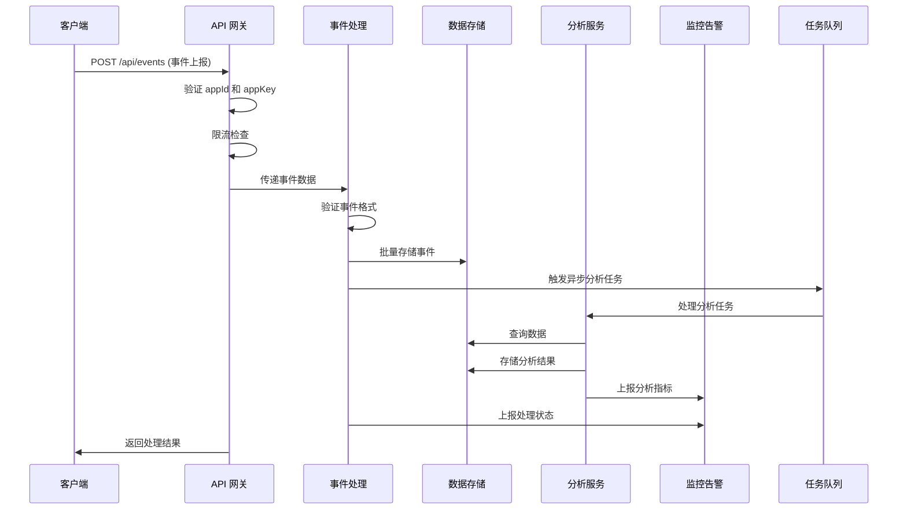

# Node-Trace 服务端设计方案

## 1. 架构设计

### 1.1 整体架构

- **架构风格**: 集成式单体应用 (Integrated Monolith)，后期可拆分为微服务
- **核心模块**:
  - API 网关: 处理请求路由、认证和限流
  - 事件处理: 接收、验证和处理客户端事件
  - 数据存储: 持久化事件数据和元数据
  - 分析服务: 提供数据分析和报表生成
  - 监控告警: 监控系统状态和异常
- **模块间依赖关系**:
  - API 网关 → 事件处理 → 数据存储
  - API 网关 → 分析服务 → 数据存储
  - 事件处理 → 监控告警
  - 分析服务 → 监控告警

### 1.2 技术栈

| 分类 | 技术 | 版本 | 选型理由 |
|------|------|------|----------|
| 语言 | Node.js | 18+ | 与客户端技术栈一致，开发效率高，支持最新的异步特性 |
| 框架 | Express | 4.x | 轻量、灵活，适合构建 API 服务，生态成熟 |
| 数据库 | PostgreSQL | 14+ | 强大的关系型数据库，支持 JSON 数据类型，适合存储结构化事件数据，事务支持完善 |
| 缓存 | Redis | 7+ | 用于缓存热点数据和管理会话，支持多种数据结构 |
| 认证 | JWT | - | 无状态认证，便于水平扩展，适合 API 服务 |
| 日志 | Winston | - | 灵活的日志管理，支持多传输目标，可配置性强 |
| 监控 | Prometheus + Grafana | - | 强大的监控和可视化能力，开源生态成熟 |
| 队列 | Bull | 4.x | 用于处理异步任务，如批量事件处理、数据分析等 |
| ORM | Sequelize | 6.x | 强大的 ORM 工具，支持 PostgreSQL，简化数据库操作 |
| 验证 | Joi | 17.x | 强大的请求数据验证库，确保数据合法性 |

### 1.3 架构流程图



## 2. API 设计

### 2.1 核心 API

#### 2.1.1 事件上报 API

- **URL**: `/api/events`
- **方法**: `POST`
- **请求体**:
  ```json
  {
    "appId": "string",
    "appKey": "string",
    "events": [
      {
        "event": "string",
        "properties": {"key": "value"},
        "timestamp": 1678901234567,
        "deviceId": "string",
        "userId": "string",
        "sessionId": "string"
      }
    ]
  }
  ```
- **响应**:
  ```json
  {
    "success": true,
    "code": 200,
    "message": "Events received successfully",
    "data": {
      "receivedCount": 5,
      "processedCount": 5,
      "eventIds": ["uuid1", "uuid2", "uuid3", "uuid4", "uuid5"]
    }
  }
  ```

#### 2.1.2 应用管理 API

##### 2.1.2.1 获取应用列表

- **URL**: `/api/apps`
- **方法**: `GET`
- **认证**: JWT
- **响应**:
  ```json
  {
    "success": true,
    "code": 200,
    "data": [
      {
        "appId": "string",
        "name": "string",
        "createdAt": "2023-01-01T00:00:00Z",
        "status": "active"
      }
    ]
  }
  ```

##### 2.1.2.2 创建应用

- **URL**: `/api/apps`
- **方法**: `POST`
- **认证**: JWT
- **请求体**:
  ```json
  {
    "name": "string",
    "description": "string"
  }
  ```
- **响应**:
  ```json
  {
    "success": true,
    "code": 201,
    "data": {
      "appId": "string",
      "name": "string",
      "appKey": "string",
      "createdAt": "2023-01-01T00:00:00Z"
    }
  }
  ```

##### 2.1.2.3 更新应用

- **URL**: `/api/apps/:appId`
- **方法**: `PUT`
- **认证**: JWT
- **请求体**:
  ```json
  {
    "name": "string",
    "description": "string",
    "status": "active"
  }
  ```
- **响应**:
  ```json
  {
    "success": true,
    "code": 200,
    "data": {
      "appId": "string",
      "name": "string",
      "description": "string",
      "status": "active",
      "updatedAt": "2023-01-01T00:00:00Z"
    }
  }
  ```

#### 2.1.3 数据分析 API

##### 2.1.3.1 事件统计

- **URL**: `/api/analytics/events`
- **方法**: `GET`
- **查询参数**:
  - `appId`: 应用 ID
  - `startTime`: 开始时间
  - `endTime`: 结束时间
  - `eventType`: 事件类型
- **响应**:
  ```json
  {
    "success": true,
    "code": 200,
    "data": {
      "totalEvents": 1000,
      "eventStats": [
        {
          "event": "page_view",
          "count": 500,
          "percentage": 50
        }
      ],
      "trend": [
        {
          "time": "2023-01-01T00:00:00Z",
          "count": 100
        }
      ]
    }
  }
  ```

##### 2.1.3.2 会话分析

- **URL**: `/api/analytics/sessions`
- **方法**: `GET`
- **查询参数**:
  - `appId`: 应用 ID
  - `startTime`: 开始时间
  - `endTime`: 结束时间
- **响应**:
  ```json
  {
    "success": true,
    "code": 200,
    "data": {
      "totalSessions": 500,
      "averageDuration": 120,
      "averagePageViews": 5,
      "trend": [
        {
          "time": "2023-01-01T00:00:00Z",
          "count": 50
        }
      ]
    }
  }
  ```

##### 2.1.3.3 用户分析

- **URL**: `/api/analytics/users`
- **方法**: `GET`
- **查询参数**:
  - `appId`: 应用 ID
  - `startTime`: 开始时间
  - `endTime`: 结束时间
- **响应**:
  ```json
  {
    "success": true,
    "code": 200,
    "data": {
      "totalUsers": 200,
      "newUsers": 50,
      "returningUsers": 150,
      "retentionRate": 75,
      "trend": [
        {
          "time": "2023-01-01T00:00:00Z",
          "count": 20
        }
      ]
    }
  }
  ```

#### 2.1.4 设备管理 API

- **URL**: `/api/devices`
- **方法**: `GET`
- **查询参数**:
  - `appId`: 应用 ID
  - `startTime`: 开始时间
  - `endTime`: 结束时间
- **响应**:
  ```json
  {
    "success": true,
    "code": 200,
    "data": {
      "totalDevices": 300,
      "deviceStats": [
        {
          "browser": "Chrome",
          "count": 150,
          "percentage": 50
        }
      ],
      "osStats": [
        {
          "os": "Windows",
          "count": 100,
          "percentage": 33.3
        }
      ]
    }
  }
  ```

### 2.2 API 版本管理

- **版本策略**: 路径前缀版本化
- **示例**: `/api/v1/events`
- **版本兼容性**: 确保向后兼容，新版本添加新功能，不删除旧功能
- **版本控制**: 在请求头中添加 `X-API-Version` 字段，优先使用路径版本

### 2.3 API 安全

- **HTTPS**: 所有 API 端点必须使用 HTTPS
- **CORS**: 配置适当的 CORS 策略，允许指定的源访问
- **Rate Limiting**: 对每个 API 端点实施速率限制，防止滥用
- **Input Validation**: 对所有请求参数进行严格验证，防止注入攻击
- **Output Encoding**: 对所有响应数据进行编码，防止 XSS 攻击

## 3. 数据库设计

### 3.1 核心表结构

#### 3.1.1 `applications` 表

| 字段名 | 数据类型 | 约束 | 描述 |
|--------|----------|------|------|
| `app_id` | `VARCHAR(36)` | `PRIMARY KEY` | 应用唯一标识 |
| `name` | `VARCHAR(255)` | `NOT NULL` | 应用名称 |
| `app_key` | `VARCHAR(255)` | `NOT NULL UNIQUE` | 应用密钥 |
| `description` | `TEXT` | | 应用描述 |
| `status` | `VARCHAR(20)` | `NOT NULL DEFAULT 'active'` | 应用状态 |
| `created_at` | `TIMESTAMP` | `NOT NULL DEFAULT CURRENT_TIMESTAMP` | 创建时间 |
| `updated_at` | `TIMESTAMP` | `NOT NULL DEFAULT CURRENT_TIMESTAMP` | 更新时间 |
| `api_rate_limit` | `INTEGER` | `NOT NULL DEFAULT 1000` | API 速率限制 (请求/分钟) |
| `event_rate_limit` | `INTEGER` | `NOT NULL DEFAULT 10000` | 事件速率限制 (事件/分钟) |

#### 3.1.2 `events` 表

| 字段名 | 数据类型 | 约束 | 描述 |
|--------|----------|------|------|
| `event_id` | `VARCHAR(36)` | `PRIMARY KEY` | 事件唯一标识 |
| `app_id` | `VARCHAR(36)` | `NOT NULL REFERENCES applications(app_id)` | 关联应用 ID |
| `event_type` | `VARCHAR(100)` | `NOT NULL` | 事件类型 |
| `properties` | `JSONB` | `NOT NULL` | 事件属性 |
| `device_id` | `VARCHAR(100)` | | 设备 ID |
| `user_id` | `VARCHAR(100)` | | 用户 ID |
| `session_id` | `VARCHAR(100)` | | 会话 ID |
| `timestamp` | `BIGINT` | `NOT NULL` | 事件发生时间戳 |
| `received_at` | `TIMESTAMP` | `NOT NULL DEFAULT CURRENT_TIMESTAMP` | 服务端接收时间 |
| `ip_address` | `VARCHAR(50)` | | 客户端 IP 地址 |
| `user_agent` | `TEXT` | | 客户端用户代理 |
| `processing_status` | `VARCHAR(20)` | `NOT NULL DEFAULT 'pending'` | 处理状态 |
| `error_message` | `TEXT` | | 错误信息 |

#### 3.1.3 `sessions` 表

| 字段名 | 数据类型 | 约束 | 描述 |
|--------|----------|------|------|
| `session_id` | `VARCHAR(100)` | `PRIMARY KEY` | 会话唯一标识 |
| `app_id` | `VARCHAR(36)` | `NOT NULL REFERENCES applications(app_id)` | 关联应用 ID |
| `device_id` | `VARCHAR(100)` | | 设备 ID |
| `user_id` | `VARCHAR(100)` | | 用户 ID |
| `start_time` | `BIGINT` | `NOT NULL` | 会话开始时间戳 |
| `end_time` | `BIGINT` | | 会话结束时间戳 |
| `duration` | `INTEGER` | | 会话持续时间 (秒) |
| `page_views` | `INTEGER` | `NOT NULL DEFAULT 0` | 页面浏览次数 |
| `events` | `INTEGER` | `NOT NULL DEFAULT 0` | 事件次数 |
| `created_at` | `TIMESTAMP` | `NOT NULL DEFAULT CURRENT_TIMESTAMP` | 创建时间 |
| `updated_at` | `TIMESTAMP` | `NOT NULL DEFAULT CURRENT_TIMESTAMP` | 更新时间 |
| `status` | `VARCHAR(20)` | `NOT NULL DEFAULT 'active'` | 会话状态 |
| `referrer` | `TEXT` | | 来源 URL |
| `landing_page` | `TEXT` | | 着陆页 URL |

#### 3.1.4 `devices` 表

| 字段名 | 数据类型 | 约束 | 描述 |
|--------|----------|------|------|
| `device_id` | `VARCHAR(100)` | `PRIMARY KEY` | 设备唯一标识 |
| `app_id` | `VARCHAR(36)` | `NOT NULL REFERENCES applications(app_id)` | 关联应用 ID |
| `browser` | `JSONB` | | 浏览器信息 |
| `os` | `JSONB` | | 操作系统信息 |
| `device` | `JSONB` | | 设备信息 |
| `first_seen` | `TIMESTAMP` | `NOT NULL DEFAULT CURRENT_TIMESTAMP` | 首次出现时间 |
| `last_seen` | `TIMESTAMP` | `NOT NULL DEFAULT CURRENT_TIMESTAMP` | 最后出现时间 |
| `is_active` | `BOOLEAN` | `NOT NULL DEFAULT TRUE` | 是否活跃 |
| `ip_address` | `VARCHAR(50)` | | 最新 IP 地址 |

#### 3.1.5 `users` 表

| 字段名 | 数据类型 | 约束 | 描述 |
|--------|----------|------|------|
| `user_id` | `VARCHAR(100)` | `PRIMARY KEY` | 用户唯一标识 |
| `app_id` | `VARCHAR(36)` | `NOT NULL REFERENCES applications(app_id)` | 关联应用 ID |
| `device_id` | `VARCHAR(100)` | | 关联设备 ID |
| `first_seen` | `TIMESTAMP` | `NOT NULL DEFAULT CURRENT_TIMESTAMP` | 首次出现时间 |
| `last_seen` | `TIMESTAMP` | `NOT NULL DEFAULT CURRENT_TIMESTAMP` | 最后出现时间 |
| `is_new` | `BOOLEAN` | `NOT NULL DEFAULT TRUE` | 是否新用户 |
| `user_properties` | `JSONB` | | 用户属性 |

#### 3.1.6 `event_analytics` 表

| 字段名 | 数据类型 | 约束 | 描述 |
|--------|----------|------|------|
| `analytics_id` | `SERIAL` | `PRIMARY KEY` | 分析记录 ID |
| `app_id` | `VARCHAR(36)` | `NOT NULL REFERENCES applications(app_id)` | 关联应用 ID |
| `event_type` | `VARCHAR(100)` | `NOT NULL` | 事件类型 |
| `count` | `INTEGER` | `NOT NULL DEFAULT 0` | 事件计数 |
| `period` | `VARCHAR(20)` | `NOT NULL` | 统计周期 (hour/day/week/month) |
| `period_start` | `TIMESTAMP` | `NOT NULL` | 周期开始时间 |
| `created_at` | `TIMESTAMP` | `NOT NULL DEFAULT CURRENT_TIMESTAMP` | 创建时间 |

### 3.2 索引设计

| 表名 | 索引名 | 索引类型 | 索引字段 | 用途 |
|------|--------|----------|----------|------|
| `events` | `idx_events_app_id` | `BTREE` | `app_id` | 按应用查询事件 |
| `events` | `idx_events_timestamp` | `BTREE` | `timestamp` | 按时间范围查询 |
| `events` | `idx_events_event_type` | `BTREE` | `event_type` | 按事件类型查询 |
| `events` | `idx_events_device_id` | `BTREE` | `device_id` | 按设备查询事件 |
| `events` | `idx_events_user_id` | `BTREE` | `user_id` | 按用户查询事件 |
| `events` | `idx_events_session_id` | `BTREE` | `session_id` | 按会话查询事件 |
| `events` | `idx_events_received_at` | `BTREE` | `received_at` | 按接收时间查询 |
| `events` | `idx_events_app_id_timestamp` | `BTREE` | `(app_id, timestamp)` | 按应用和时间范围查询 |
| `sessions` | `idx_sessions_app_id` | `BTREE` | `app_id` | 按应用查询会话 |
| `sessions` | `idx_sessions_device_id` | `BTREE` | `device_id` | 按设备查询会话 |
| `sessions` | `idx_sessions_user_id` | `BTREE` | `user_id` | 按用户查询会话 |
| `sessions` | `idx_sessions_start_time` | `BTREE` | `start_time` | 按时间范围查询会话 |
| `sessions` | `idx_sessions_app_id_start_time` | `BTREE` | `(app_id, start_time)` | 按应用和时间范围查询会话 |
| `devices` | `idx_devices_app_id` | `BTREE` | `app_id` | 按应用查询设备 |
| `devices` | `idx_devices_last_seen` | `BTREE` | `last_seen` | 按最后出现时间查询 |
| `devices` | `idx_devices_app_id_last_seen` | `BTREE` | `(app_id, last_seen)` | 按应用和最后出现时间查询 |
| `users` | `idx_users_app_id` | `BTREE` | `app_id` | 按应用查询用户 |
| `users` | `idx_users_last_seen` | `BTREE` | `last_seen` | 按最后出现时间查询 |
| `users` | `idx_users_app_id_last_seen` | `BTREE` | `(app_id, last_seen)` | 按应用和最后出现时间查询 |
| `event_analytics` | `idx_event_analytics_app_id` | `BTREE` | `app_id` | 按应用查询分析数据 |
| `event_analytics` | `idx_event_analytics_period_start` | `BTREE` | `period_start` | 按周期开始时间查询 |
| `event_analytics` | `idx_event_analytics_app_id_period` | `BTREE` | `(app_id, period, period_start)` | 按应用、周期类型和周期开始时间查询 |

### 3.3 数据分区

- **时间分区**: `events` 表按 `received_at` 字段进行按月分区，提高查询性能
- **应用分区**: 对于大规模应用，可考虑按 `app_id` 进行水平分区
- **分区管理**:
  - 自动创建下一个月的分区
  - 定期归档超过 6 个月的分区数据
  - 对归档数据进行压缩存储

### 3.4 数据备份与恢复

- **备份策略**:
  - 数据库每日全量备份
  - 数据库每小时增量备份
  - 配置文件定期备份
- **恢复流程**:
  - 停止服务
  - 恢复数据库
  - 恢复配置
  - 启动服务
  - 验证数据完整性
- **灾难恢复**:
  - 异地备份存储
  - 定期灾难恢复演练
  - 恢复时间目标 (RTO): 4 小时
  - 恢复点目标 (RPO): 1 小时

## 4. 核心功能设计

### 4.1 事件处理流程

1. **接收请求**: API 网关接收客户端事件上报请求
2. **请求验证**: 
   - 验证 `appId` 和 `appKey` 是否匹配
   - 验证事件数据格式是否正确
   - 验证事件数量是否在限制范围内 (默认最大 100 个/请求)
   - 验证请求频率是否超过限制
3. **事件处理**: 
   - 为每个事件生成唯一 ID (UUID v4)
   - 补充服务端信息 (如接收时间、IP 地址、用户代理)
   - 解析事件属性，提取设备 ID、用户 ID、会话 ID 等关键信息
   - 验证事件时间戳是否合理 (防止时间篡改)
4. **数据存储**: 
   - 批量插入事件数据到 `events` 表
   - 更新或创建 `sessions` 记录
   - 更新或创建 `devices` 记录
   - 更新或创建 `users` 记录
5. **响应客户端**: 返回处理结果，包含成功处理的事件数量和事件 ID
6. **异步处理**: 
   - 触发数据分析任务 (使用 Bull 队列)
   - 更新实时统计指标 (Redis 缓存)
   - 发送告警通知 (如有异常)

### 4.2 会话管理

- **会话创建**: 当收到新的会话 ID 时创建会话记录，记录会话开始时间、来源 URL 和着陆页
- **会话更新**: 
  - 定期更新会话持续时间、页面浏览次数和事件次数
  - 记录会话中的关键事件和页面访问
  - 使用 Redis 缓存活跃会话，减少数据库查询
- **会话结束**: 
  - 客户端主动结束会话 (发送 `session_end` 事件)
  - 会话超时 (默认 30 分钟无活动)
  - 设备离线 (长时间无事件上报)
- **会话分析**: 
  - 计算会话持续时间
  - 分析会话中的事件序列
  - 识别会话来源和转化路径

### 4.3 数据分析

- **实时分析**: 
  - 使用 Redis 缓存实时统计数据
  - 支持分钟级、小时级统计
  - 提供实时事件流和趋势图表
- **离线分析**: 
  - 使用定时任务处理历史数据 (每小时/每天)
  - 生成日报、周报、月报
  - 执行复杂的数据分析算法
- **分析维度**:
  - 事件类型分布: 分析不同事件类型的发生频率和占比
  - 用户行为路径: 追踪用户在应用中的行为序列
  - 设备分布: 分析用户设备类型、浏览器和操作系统分布
  - 会话统计: 分析会话数量、持续时间、页面浏览次数等
  - 留存率分析: 分析用户次日、7日、30日留存率
  - 漏斗分析: 分析用户转化漏斗，识别流失环节
  - 用户分群: 根据用户行为和属性进行分群分析
  - A/B 测试: 支持实验数据收集和分析

### 4.4 监控告警

- **系统监控**:
  - CPU、内存、磁盘使用率
  - 网络流量和延迟
  - 数据库连接数和查询性能
  - Redis 缓存使用率
  - 队列任务积压情况
- **业务监控**:
  - 事件接收量和处理率
  - API 响应时间和错误率
  - 会话创建和结束数量
  - 设备和用户增长趋势
  - 异常事件和错误模式
- **告警策略**:
  - 阈值告警: 当指标超过预设阈值时触发
  - 趋势告警: 当指标变化趋势异常时触发
  - 异常检测: 使用机器学习算法检测异常模式
  - 告警级别: 信息、警告、严重、紧急
- **告警通知**:
  - 邮件通知: 详细的告警信息和分析
  - 短信通知: 紧急告警的快速通知
  - 企业微信/钉钉: 团队协作工具集成
  - 电话通知: 严重告警的语音通知

### 4.5 数据导出

- **导出格式**: CSV、JSON、Excel
- **导出内容**:
  - 事件数据
  - 会话数据
  - 用户数据
  - 分析报表
- **导出方式**:
  - API 接口导出
  - 后台管理系统手动导出
  - 定时自动导出到指定存储

### 4.6 数据清理

- **清理策略**:
  - 事件数据: 保留 6 个月，超过时间归档
  - 会话数据: 保留 12 个月，超过时间归档
  - 设备数据: 长期保留，标记不活跃设备
  - 用户数据: 长期保留，遵循数据隐私法规
- **清理方式**:
  - 定时任务自动清理
  - 手动触发清理
  - 归档到冷存储

## 5. 部署与运维

### 5.1 部署架构

#### 5.1.1 开发环境

- **架构**: 本地 Docker 容器
- **组件**:
  - Node.js 应用容器
  - PostgreSQL 容器
  - Redis 容器
  - 本地代码挂载

#### 5.1.2 测试环境

- **架构**: 单节点服务器
- **组件**:
  - Node.js 应用 (PM2 管理)
  - PostgreSQL 数据库
  - Redis 缓存
  - 基础监控

#### 5.1.3 生产环境

- **架构**: 多节点负载均衡
- **组件**:
  - 负载均衡器 (Nginx/AWS ALB)
  - 应用服务器集群 (多节点)
  - PostgreSQL 主从复制
  - Redis 集群 (主从 + 哨兵)
  - 监控系统 (Prometheus + Grafana)
  - 日志系统 (ELK Stack)
  - 告警系统 (Alertmanager)

### 5.2 部署流程

1. **代码构建**: 
   - 安装依赖 (`npm install`)
   - 运行测试 (`npm test`)
   - 构建应用 (`npm run build`)
   - 代码质量检查 (`npm run lint`)
2. **容器化**: 
   - 构建 Docker 镜像 (`docker build -t node-trace-server .`)
   - 推送镜像到镜像仓库 (如 Docker Hub、AWS ECR)
3. **部署**: 
   - 使用 Docker Compose 部署 (开发/测试环境)
   - 使用 Kubernetes 部署 (生产环境)
   - 配置环境变量和密钥
   - 启动服务
4. **验证**: 
   - 健康检查 (`/health` 端点)
   - 功能测试 (API 测试)
   - 性能测试 (负载测试)
   - 安全测试 (漏洞扫描)

### 5.3 配置管理

- **配置分类**:
  - 环境变量 (敏感配置): 数据库密码、JWT 密钥等
  - 配置文件 (非敏感配置): 应用配置、日志配置等
  - 数据库配置 (动态配置): 告警阈值、限流规则等
- **配置管理工具**:
  - 开发/测试环境: `.env` 文件
  - 生产环境: Kubernetes ConfigMap 和 Secret
- **配置项**:
  - 数据库连接信息
  - Redis 连接信息
  - JWT 密钥和过期时间
  - 日志配置 (级别、格式、存储)
  - 限流配置 (API 速率、事件速率)
  - 告警阈值 (系统指标、业务指标)
  - 存储配置 (备份策略、清理策略)

### 5.4 日志管理

- **日志级别**: DEBUG, INFO, WARN, ERROR, FATAL
- **日志格式**: JSON 格式，包含时间戳、级别、消息、上下文等
- **日志存储**:
  - 本地文件: 按日期轮转
  - 集中式日志系统: ELK Stack (Elasticsearch + Logstash + Kibana)
  - 云服务: AWS CloudWatch, Google Cloud Logging
- **日志轮转**:
  - 按大小轮转: 单个日志文件最大 100MB
  - 按时间轮转: 每日生成新日志文件
  - 保留期限: 保留 30 天的日志
- **日志分析**:
  - 实时日志监控
  - 日志查询和过滤
  - 日志聚合和统计
  - 异常检测和告警

### 5.5 备份与恢复

- **备份策略**:
  - 数据库每日全量备份
  - 数据库每小时增量备份
  - 配置文件和代码仓库定期备份
  - 备份存储: 异地存储，至少 3 份副本
- **恢复流程**:
  - 停止服务
  - 恢复数据库 (从最新备份)
  - 恢复配置文件
  - 启动服务
  - 验证数据完整性和服务可用性
- **灾难恢复**:
  - 灾备方案: 多区域部署
  - 恢复时间目标 (RTO): 4 小时
  - 恢复点目标 (RPO): 1 小时
  - 定期灾难恢复演练

### 5.6 监控与告警

- **监控系统**:
  - 基础设施监控: Prometheus + Grafana
  - 应用监控: 自定义指标 + Prometheus
  - 数据库监控: PostgreSQL 专用监控
  - 容器监控: cAdvisor + Prometheus
- **告警系统**:
  - 告警管理器: Alertmanager
  - 告警渠道: 邮件、短信、企业微信、钉钉
  - 告警级别: 信息、警告、严重、紧急
  - 告警规则: 基于阈值、趋势、异常检测
- **监控面板**:
  - 系统概览面板
  - 应用性能面板
  - 数据库性能面板
  - 业务指标面板
  - 告警状态面板

### 5.7 自动化运维

- **CI/CD 流程**:
  - 代码提交触发构建
  - 自动化测试
  - 自动化部署
  - 自动化验证
- **自动化工具**:
  - Jenkins: 持续集成和部署
  - GitHub Actions: 代码仓库集成
  - Ansible: 配置管理和自动化
  - Terraform: 基础设施即代码
- **自动化任务**:
  - 定时备份
  - 日志清理
  - 数据归档
  - 系统更新
  - 安全扫描

### 5.8 安全运维

- **安全措施**:
  - 定期安全扫描
  - 漏洞管理
  - 安全补丁更新
  - 入侵检测
  - 访问控制
- **安全审计**:
  - 定期安全审计
  - 合规性检查
  - 日志审计
  - 权限审计
- **安全事件响应**:
  - 安全事件检测
  - 事件响应流程
  - 事件记录和分析
  - 事后复盘和改进

## 6. 安全设计

### 6.1 认证与授权

- **应用认证**: 
  - 使用 `appId` 和 `appKey` 进行应用级认证
  - `appKey` 使用 HMAC-SHA256 加密存储
  - 支持 API 密钥的创建、轮换和禁用
- **用户认证**:
  - 管理后台使用 JWT 进行认证
  - 密码使用 bcrypt 加密存储
  - 支持多因素认证 (MFA)
- **授权策略**:
  - 基于角色的访问控制 (RBAC)
  - 最小权限原则
  - 权限细分到 API 端点级别
- **请求限流**:
  - 按应用限流: 基于 `appId` 的请求频率限制
  - 按 IP 限流: 基于客户端 IP 的请求频率限制
  - 按端点限流: 不同 API 端点设置不同的限流规则
  - 防止 DDoS 攻击: 使用令牌桶算法实现平滑限流

### 6.2 数据安全

- **数据加密**:
  - 传输加密: 所有 API 通信使用 HTTPS
  - 存储加密: 
    - 敏感字段使用 AES-256 加密存储
    - 数据库传输使用 SSL/TLS
    - Redis 缓存使用密码认证和 SSL
- **数据脱敏**:
  - 对敏感信息进行脱敏处理: 如 IP 地址、用户标识等
  - 遵循数据隐私法规: GDPR、CCPA 等
  - 支持数据访问审计和合规性报告
- **数据访问控制**:
  - 数据库用户最小权限原则
  - API 访问控制: 基于令牌的权限验证
  - 内部服务间通信: 使用 mTLS 加密
- **数据备份安全**:
  - 备份数据加密存储
  - 备份传输加密
  - 定期测试备份恢复流程

### 6.3 网络安全

- **网络隔离**:
  - 生产环境与开发/测试环境隔离
  - 应用服务器与数据库服务器网络隔离
  - 使用 VPC 或私有网络
- **防火墙**:
  - 配置适当的防火墙规则
  - 只开放必要的端口
  - 使用 Web 应用防火墙 (WAF) 防护 HTTP 攻击
- **入侵检测与防御**:
  - 部署入侵检测系统 (IDS)
  - 部署入侵防御系统 (IPS)
  - 实时监控网络流量异常
- **漏洞管理**:
  - 定期进行漏洞扫描
  - 及时更新依赖和系统组件
  - 使用依赖扫描工具检测已知漏洞
  - 定期进行安全渗透测试

### 6.4 应用安全

- **代码安全**:
  - 代码质量检查: 使用 ESLint、Prettier 等工具
  - 静态代码分析: 使用 SonarQube 等工具检测安全漏洞
  - 代码审查: 强制代码审查流程
- **输入验证**:
  - 所有用户输入严格验证
  - 使用参数化查询防止 SQL 注入
  - 使用 HTML 转义防止 XSS 攻击
  - 使用 CSRF 令牌防止跨站请求伪造
- **错误处理**:
  - 不向客户端暴露详细错误信息
  - 统一的错误处理机制
  - 详细的错误日志记录
- **依赖管理**:
  - 定期更新依赖包
  - 使用锁定文件确保依赖版本一致性
  - 检测并移除未使用的依赖

### 6.5 安全监控与响应

- **安全监控**:
  - 实时监控安全事件
  - 监控异常登录尝试
  - 监控数据访问异常
  - 监控网络流量异常
- **安全告警**:
  - 安全事件分级告警
  - 多渠道告警通知
  - 告警响应流程自动化
- **安全事件响应**:
  - 安全事件响应预案
  - 事件分级处理流程
  - 事后分析和改进
  - 定期安全演练

### 6.6 合规性

- **数据隐私合规**:
  - 遵循 GDPR、CCPA 等数据隐私法规
  - 支持数据主体权利: 访问、删除、导出等
  - 数据处理记录和合规性文档
- **行业合规**:
  - 遵循行业特定的安全标准
  - 定期进行合规性审计
  - 合规性认证: ISO 27001、SOC 2 等


## 7. 扩展性设计

### 7.1 水平扩展

- **无状态设计**: 
  - 服务端保持无状态，所有状态存储在 Redis 或数据库中
  - 便于水平扩展，支持多实例部署
  - 会话管理使用 Redis 共享存储
- **负载均衡**: 
  - 使用 Nginx 或 AWS ALB 作为负载均衡器
  - 支持轮询、IP 哈希等负载均衡算法
  - 健康检查机制，自动剔除故障实例
- **自动缩放**: 
  - 基于 CPU 使用率、内存使用率等指标自动缩放
  - 支持 Kubernetes Horizontal Pod Autoscaler
  - 配置缩放策略，避免频繁缩放

### 7.2 功能扩展

- **插件系统**: 
  - 支持通过插件扩展功能
  - 插件生命周期管理: 加载、初始化、销毁
  - 插件 API: 提供统一的插件接口
  - 内置插件: 事件处理、数据分析、告警通知等
- **Webhook**: 
  - 支持通过 Webhook 与外部系统集成
  - 事件触发 Webhook: 如事件上报、告警触发等
  - Webhook 配置管理: 支持多个 Webhook 端点
  - Webhook 重试机制: 确保消息送达
- **API 扩展**: 
  - 提供开放 API，支持第三方集成
  - API 版本管理: 确保向后兼容
  - API 文档: 使用 Swagger/OpenAPI 自动生成文档
  - API 沙箱: 提供测试环境

### 7.3 数据扩展

- **数据分片**: 
  - 按应用分片: 不同应用的数据存储在不同的数据库实例
  - 按时间分片: 事件数据按时间范围存储在不同的表或分区
  - 分片策略: 一致性哈希、范围分片等
  - 分片管理: 自动分片、手动分片
- **读写分离**: 
  - 实现数据库读写分离，提高读取性能
  - 主库处理写操作，从库处理读操作
  - 数据同步: 使用 PostgreSQL 主从复制
  - 故障切换: 自动或手动切换主库
- **缓存策略**: 
  - 合理使用缓存，减少数据库压力
  - 多级缓存: 本地缓存 + Redis 分布式缓存
  - 缓存一致性: 确保缓存与数据库数据一致
  - 缓存过期策略: 基于时间、基于容量等

### 7.4 微服务架构演进

- **服务拆分策略**:
  - 按功能域拆分: 事件服务、分析服务、管理服务等
  - 按数据域拆分: 用户服务、设备服务、会话服务等
  - 渐进式拆分: 先拆出边界清晰的服务
- **服务间通信**:
  - 同步通信: RESTful API、gRPC
  - 异步通信: 消息队列 (Kafka、RabbitMQ)
  - 服务发现: Consul、Etcd
  - 配置中心: Spring Cloud Config、Apollo
- **微服务治理**:
  - 服务监控: 跟踪每个服务的健康状态
  - 服务熔断: 防止级联故障
  - 服务限流: 保护服务不被过载
  - 服务降级: 在资源不足时保证核心功能

### 7.5 多租户支持

- **租户隔离**:
  - 数据隔离: 不同租户的数据存储在不同的表或数据库
  - 资源隔离: 不同租户使用独立的资源配额
  - 网络隔离: 不同租户的网络流量隔离
- **租户管理**:
  - 租户生命周期管理: 创建、更新、删除
  - 租户配置管理: 每个租户有独立的配置
  - 租户权限管理: 基于租户的访问控制
- **多租户计费**:
  - 基于使用量的计费: 事件数量、存储容量等
  - 基于功能的计费: 基础版、高级版、企业版
  - 计费周期: 月度、年度

### 7.6 国际化支持

- **多语言支持**:
  - 接口响应支持多语言
  - 错误消息国际化
  - 管理后台多语言界面
- **时区支持**:
  - 存储 UTC 时间，根据用户时区显示
  - 支持不同时区的数据分析
- **区域部署**:
  - 支持多区域部署，减少延迟
  - 数据本地化存储，符合数据主权要求

## 8. 性能优化

### 8.1 代码优化

- **异步处理**: 
  - 使用 async/await 和 Promise 处理异步操作
  - 避免同步阻塞操作
  - 合理使用 Promise.all() 处理并发操作
  - 避免回调地狱
- **批量处理**: 
  - 批量插入和更新数据，减少数据库操作次数
  - 批量处理事件，减少网络往返
  - 批量发送日志，减少 I/O 操作
- **内存管理**: 
  - 合理使用内存，避免内存泄漏
  - 及时释放不再使用的资源
  - 使用对象池减少 GC 压力
  - 监控内存使用，设置告警阈值
- **代码分割**: 
  - 按需加载模块，减少启动时间
  - 使用动态导入 (import()) 加载非核心模块
  - 优化模块依赖，减少不必要的依赖
- **算法优化**: 
  - 选择合适的算法和数据结构
  - 避免嵌套循环和复杂计算
  - 预处理和缓存计算结果

### 8.2 数据库优化

- **索引优化**: 
  - 合理设计索引，提高查询性能
  - 避免过多索引，影响写入性能
  - 使用复合索引，优化多字段查询
  - 定期重建索引，保持索引效率
- **查询优化**: 
  - 优化 SQL 查询，避免全表扫描
  - 使用 EXPLAIN 分析查询执行计划
  - 避免 SELECT *，只查询必要的字段
  - 使用 LIMIT 限制结果集大小
- **连接池**: 
  - 使用数据库连接池，减少连接建立开销
  - 合理设置连接池大小
  - 监控连接池状态，避免连接泄漏
- **批量操作**: 
  - 使用批量插入和更新，提高写入性能
  - 避免单条数据多次操作
  - 使用事务保证数据一致性
- **分区表**: 
  - 使用分区表管理大量数据
  - 按时间或应用 ID 进行分区
  - 提高查询和维护性能
- **数据库配置**: 
  - 优化 PostgreSQL 配置参数
  - 调整共享内存、工作内存等参数
  - 配置合适的 WAL 级别

### 8.3 网络优化

- **压缩传输**: 
  - 使用 gzip 或 brotli 压缩 HTTP 响应
  - 压缩 JSON 数据，减少传输大小
  - 合理设置压缩级别，平衡 CPU 开销和压缩率
- **缓存策略**: 
  - 合理设置 HTTP 缓存头
  - 使用 ETag 和 Last-Modified 进行缓存验证
  - 缓存静态资源，减少重复请求
- **CDN 加速**: 
  - 使用 CDN 加速静态资源
  - 缓存 API 响应，减少源站压力
  - 选择合适的 CDN 节点，减少延迟
- **请求合并**: 
  - 支持批量 API，减少 HTTP 请求次数
  - 合并多个小请求为一个大请求
  - 实现 GraphQL API，按需获取数据
- **网络协议**: 
  - 使用 HTTP/2 或 HTTP/3，减少连接开销
  - 启用 TCP Fast Open，加速连接建立
  - 优化 TLS 配置，减少握手开销

### 8.4 缓存优化

- **多级缓存**: 
  - 本地缓存: 使用内存缓存热点数据
  - 分布式缓存: 使用 Redis 缓存共享数据
  - 浏览器缓存: 缓存静态资源和 API 响应
- **缓存策略**: 
  - 基于时间的过期策略
  - 基于容量的淘汰策略 (LRU、LFU 等)
  - 基于事件的失效策略
  - 缓存预热: 提前加载热点数据
- **缓存一致性**: 
  - 确保缓存与数据库数据一致
  - 使用读写锁或乐观锁处理并发
  - 实现缓存失效机制
- **Redis 优化**: 
  - 合理设计 Redis 数据结构
  - 使用管道 (pipeline) 批量执行命令
  - 启用 Redis 持久化，保证数据安全
  - 监控 Redis 内存使用，设置最大内存

### 8.5 负载优化

- **负载均衡**: 
  - 使用合适的负载均衡算法
  - 配置健康检查，自动剔除故障节点
  - 实现会话粘性，提高用户体验
- **限流保护**: 
  - 实现 API 限流，防止过载
  - 使用令牌桶或漏桶算法平滑流量
  - 对不同等级的用户设置不同的限流规则
- **降级策略**: 
  - 在系统负载过高时启用降级
  - 优先保证核心功能可用
  - 降级非核心服务，释放资源
- **熔断机制**: 
  - 实现服务熔断，防止级联故障
  - 监控服务健康状态，自动熔断故障服务
  - 配置熔断恢复策略

### 8.6 监控与调优

- **性能监控**: 
  - 监控系统和应用性能指标
  - 使用 APM 工具 (如 New Relic、Datadog) 跟踪性能
  - 监控慢查询和瓶颈操作
- **性能分析**: 
  - 使用 Node.js 内置的性能分析工具
  - 定期进行性能分析，识别瓶颈
  - 优化热点代码路径
- **基准测试**: 
  - 定期进行基准测试，评估性能改进
  - 比较不同优化方案的效果
  - 建立性能基线，监控性能变化
- **调优策略**: 
  - 基于数据驱动的调优
  - 小步迭代，避免大规模重构
  - 验证调优效果，确保性能提升

## 9. 监控与告警

### 9.1 监控指标

| 分类 | 指标 | 单位 | 监控频率 | 告警阈值 |
|------|------|------|----------|----------|
| 系统 | CPU 使用率 | % | 10s | > 80% 持续 5min |
| 系统 | 内存使用率 | % | 10s | > 85% 持续 5min |
| 系统 | 磁盘使用率 | % | 1min | > 90% |
| 系统 | 网络流量 | MB/s | 10s | > 100MB/s 持续 1min |
| 应用 | 响应时间 | ms | 1s | > 500ms 持续 1min |
| 应用 | QPS | 请求/秒 | 1s | > 1000 请求/秒 |
| 应用 | 错误率 | % | 1min | > 1% 持续 5min |
| 数据库 | 查询响应时间 | ms | 1s | > 200ms 持续 1min |
| 数据库 | 连接数 | 个 | 10s | > 50 个持续 5min |
| 业务 | 事件接收量 | 个/分钟 | 1min | < 10 个/分钟持续 10min |
| 业务 | 会话数 | 个/分钟 | 1min | < 1 个/分钟持续 10min |

### 9.2 告警渠道

- **邮件告警**: 发送详细告警邮件
- **短信告警**: 发送紧急告警短信
- **微信告警**: 发送告警消息到企业微信
- **Slack/钉钉告警**: 发送告警消息到团队协作工具
- **电话告警**: 发送严重告警电话通知 (可选)

## 10. 开发与测试

### 10.1 开发流程

- **代码风格**: 使用 ESLint 和 Prettier 保持代码风格一致
- **版本控制**: 使用 Git 进行版本控制，遵循 Git Flow 工作流
- **分支策略**:
  - `main`: 主分支，用于生产环境
  - `develop`: 开发分支，用于集成测试
  - `feature/*`: 特性分支，用于开发新功能
  - `hotfix/*`: 热修复分支，用于紧急修复

### 10.2 测试策略

- **单元测试**: 测试单个函数和模块
- **集成测试**: 测试模块之间的交互
- **端到端测试**: 测试完整的业务流程
- **性能测试**: 测试系统性能和稳定性
- **安全测试**: 测试系统安全性

### 10.3 测试工具

| 分类 | 工具 | 版本 | 用途 |
|------|------|------|------|
| 单元测试 | Jest | 28+ | 运行单元测试 |
| 集成测试 | Supertest | 6+ | 测试 HTTP API |
| 端到端测试 | Cypress | 10+ | 运行端到端测试 |
| 性能测试 | Artillery | 2+ | 运行性能测试 |
| 安全测试 | OWASP ZAP | 2.11+ | 进行安全扫描 |

## 11. 部署与运维

### 11.1 环境配置

| 环境 | 配置 |
|------|------|
| 开发 | 本地 Docker 容器，单节点，最小配置 |
| 测试 | 单节点服务器，中等配置 |
| 生产 | 多节点负载均衡，高配置，冗余设计 |

### 11.2 资源需求

| 环境 | CPU | 内存 | 磁盘 | 网络 |
|------|------|------|------|------|
| 开发 | 2 核 | 4GB | 50GB | 100Mbps |
| 测试 | 4 核 | 8GB | 100GB | 1Gbps |
| 生产 | 8 核+ | 16GB+ | 500GB+ | 1Gbps+ |

### 11.3 部署工具

| 工具 | 用途 |
|------|------|
| Docker | 容器化应用 |
| Docker Compose | 本地开发和测试环境部署 |
| Kubernetes | 生产环境部署和管理 |
| Terraform | 基础设施即代码 |
| Ansible | 配置管理 |

## 12. 文档与知识管理

### 12.1 文档结构

- **架构文档**: 系统架构设计
- **API 文档**: API 接口说明
- **部署文档**: 部署流程和配置
- **开发文档**: 开发指南和最佳实践
- **故障排查文档**: 常见问题和解决方案

### 12.2 文档工具

- **API 文档**: Swagger/OpenAPI
- **架构文档**: C4 Model
- **技术文档**: Markdown + GitBook
- **知识库**: Confluence (可选)

## 13. 风险评估

### 13.1 技术风险

| 风险 | 可能性 | 影响 | 缓解措施 |
|------|--------|------|----------|
| 数据库性能瓶颈 | 高 | 系统响应缓慢 | 合理设计索引，使用读写分离，考虑分片 |
| 内存泄漏 | 中 | 服务崩溃 | 代码审查，监控内存使用，定期重启服务 |
| 网络攻击 | 中 | 数据泄露，服务中断 | 实施安全措施，使用 WAF，定期安全扫描 |
| 依赖包漏洞 | 中 | 安全风险 | 定期更新依赖，使用依赖扫描工具 |

### 13.2 业务风险

| 风险 | 可能性 | 影响 | 缓解措施 |
|------|--------|------|----------|
| 数据量增长过快 | 高 | 存储成本增加，查询性能下降 | 实施数据分区，定期归档数据，使用数据压缩 |
| 用户量突增 | 中 | 系统负载过高 | 设计弹性架构，使用自动缩放，实施限流 |
| 数据隐私合规 | 中 | 法律风险 | 遵循数据隐私法规，实施数据脱敏，获取用户同意 |
| 服务中断 | 低 | 业务损失 | 实施高可用性设计，定期备份，制定灾难恢复计划 |

## 14. 未来规划

### 14.1 功能规划

| 阶段 | 功能 | 时间估计 |
|------|------|----------|
| Phase 1 | 核心事件处理，基础数据存储，简单分析 | 1-2 个月 |
| Phase 2 | 高级分析，报表生成，监控告警 | 2-3 个月 |
| Phase 3 | 实时分析，预测分析，机器学习集成 | 3-4 个月 |
| Phase 4 | 微服务拆分，多租户支持，国际化 | 4-6 个月 |

### 14.2 技术演进

- **架构演进**: 从集成式单体应用到微服务架构
- **数据存储**: 从单一数据库到多存储引擎 (时序数据库用于时间序列数据)
- **分析引擎**: 从内置分析到集成专业分析引擎
- **部署方式**: 从容器化到云原生

### 14.3 扩展性考虑

- **多租户**: 支持多租户架构，隔离不同应用的数据
- **国际化**: 支持多语言和时区
- **API 版本**: 支持 API 版本管理
- **插件生态**: 构建插件生态系统，支持第三方集成

## 15. 结论

本设计方案为 Node-Trace 服务端提供了全面的架构和功能规划，涵盖了从技术选型到部署运维的各个方面。方案采用了成熟的技术栈和设计模式，同时预留了足够的扩展性和灵活性，以适应未来业务的增长和变化。

通过本方案的实施，Node-Trace 服务端将能够高效地处理客户端事件，提供丰富的数据分析能力，为业务决策提供有力支持。同时，系统的可靠性、安全性和可扩展性也将得到保障，确保服务的稳定运行。